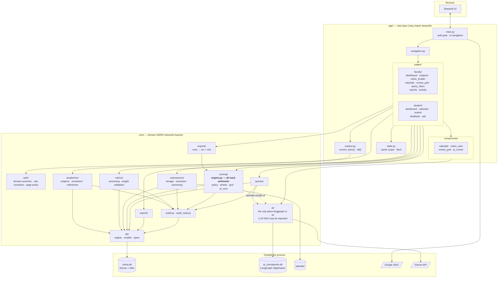

# Architecture Diagram

One Streamlit process, split in two. The dividing line is the only
architectural rule in the project, and it is enforced by a test
([`tests/core/test_no_streamlit_in_core.py`](../../tests/core/test_no_streamlit_in_core.py))
that greps every file under `core/` for a Streamlit import.

## Why the split is drawn here

| Rule | Consequence |
|---|---|
| `core/` may not import Streamlit | The domain is unit-testable without a browser or a session, which is why 606 of the 645 tests need no Streamlit runtime |
| `app/` may not do mark arithmetic | There is one place a total can be computed, so the grid, the exporters, and the reports page cannot disagree |
| Only `core/ai/` may import LangGraph or an LLM SDK | Callers see three plain functions; the graph is an implementation detail that can be replaced without touching a page |
| Only `core/db/` knows the dialect | Changing database engine is a URL change |
| Every public function in `core/` takes `actor` first | Scoping is a signature-level requirement, checked by reflection, not a convention people remember |

## The two databases

They are deliberately separate files.

* `rubriq.db` holds marks. It is the artifact that would be copied into the
  report appendix.
* `ai_checkpoints.db` holds LangGraph's per-thread graph state.

A corrupt checkpoint can be deleted outright — the worst case is that an
evaluation re-runs — without touching a single mark. Putting both in one file
would make that recovery impossible.

## Request path, end to end

1. Streamlit reruns the script. `main.py` loads settings from `st.secrets`.
2. Claims arrive from Google OIDC (or the gitignored local dev stand-in).
3. `authenticate()` asserts the `@pccoepune.org` domain and resolves the role
   from the allow-list. **This happens on every rerun**, from settings, never
   from `session_state`.
4. `build_navigation(actor)` constructs `st.Page` objects for that role only.
   A page a student may not open is never built, so there is nothing to reach.
5. The page calls into `core/` with `actor` as the first argument. Scoping
   happens in the SQL `WHERE` clause.
6. Mutations run inside one transaction that also writes an audit row.
7. The page invalidates the actor-scoped cache and reruns.
