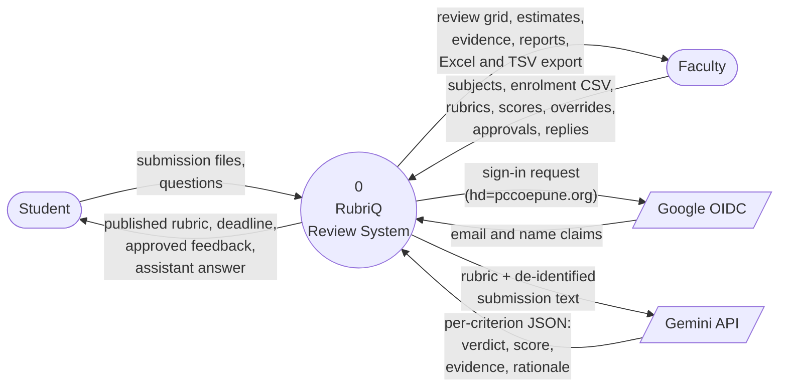

# Data Flow Diagram — Level 0 (Context)

RubriQ as a single process, and everything outside it.

## Notes on the flows

* **Nothing identifying crosses the boundary to the model.** The arrow to the
  Gemini API carries rubric text and submission text with the student's name,
  PRN, and email removed (`core/ai/identity.py`). The mapping back is held
  inside the process.
* **The model returns a proposal, never a mark.** Everything on that return
  arrow is an estimate until a faculty member approves it.
* **Google is asked for identity, not for authorisation.** The domain check
  and the role lookup both happen inside the system, from the returned email
  claim.
* **The Gemini arrow is optional.** Remove it and the diagram still describes
  a working system: manual scoring, penalties, approval, and export are
  untouched.
