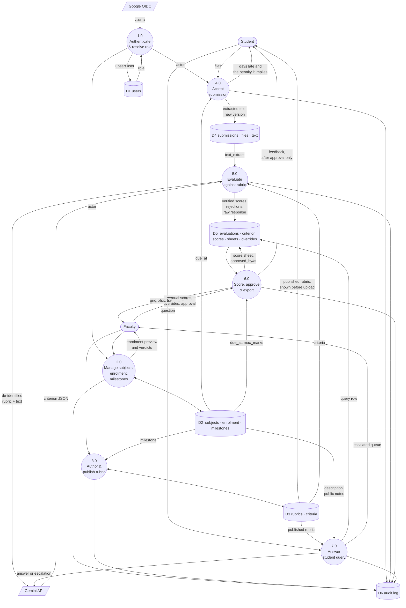

# Data Flow Diagram — Level 1

Process 0 from [`dfd-l0.md`](dfd-l0.md), opened up. Seven processes and six
data stores.

## Reading the diagram

**Every process writes to D6.** That is not diagram clutter — it is invariant:
every mutation writes exactly one audit row inside the same transaction as the
change. Streamlit gives no request log worth reading, so this store is the
only record of who did what.

**Process 5.0 reads D4 and D3 but never writes to them.** The evaluation
process consumes a submission's text and a rubric's criteria and produces
scores. It cannot modify either, and it has no path to D1 or D2 at all — which
is what "the graph has no tools" means concretely.

**Process 6.0 is the only writer of a total.** Processes 5.0 and 7.0 produce
verdicts and answers; the arithmetic that turns criterion scores into a mark
happens in one place, fed by D5 and by the milestone's `due_at` and
`max_marks` from D2.

**The rubric reaches the student from D3 before 4.0 accepts anything.** That
arrow is the whole thesis of the system, so it is drawn even though it is a
read rather than a process output.

**D5 holds student queries** alongside evaluation rows. They are grouped here
because both are per-student outputs of an AI process with a faculty
follow-up; in the schema they are separate tables.
