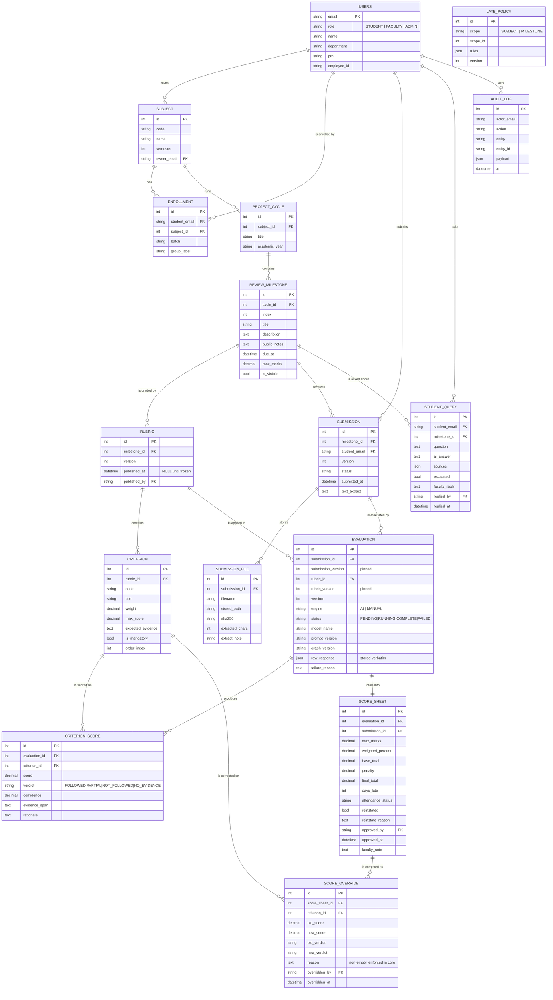

# Entity–Relationship Diagram

Nineteen tables, defined in [`core/db/models.py`](../../core/db/models.py) and
created by the migrations in [`alembic/versions/`](../../alembic/versions/).
Attribute lists below are the columns that carry meaning; timestamps and
`is_active` flags are omitted where they say nothing about the relationship.

Three things in this diagram are load-bearing and are easy to miss:

* **`evaluation` pins its inputs.** It stores `submission_version` and
  `rubric_version` as values, not just foreign keys, so re-evaluating cannot
  retroactively change what an approved mark was measured against.
* **`score_sheet` references an `evaluation`, never a bare submission.** A
  sheet is always the consequence of one specific evaluation run.
* **`verdict` lives on `criterion_score` as its own column.** It is stored,
  not derived from the score when rendering — that is what makes "followed
  versus not followed" answerable.

## Key constraints

These are the ones that carry a rule rather than tidiness.

| Constraint | Table | Why it exists |
|---|---|---|
| `UNIQUE (milestone_id, student_email, version)` | `submission` | Two v2s from the same student would make "which one was graded" unanswerable |
| `UNIQUE (submission_id, version)` | `evaluation` | A retry must produce a *new* version, not a second row at the same one |
| `UNIQUE (evaluation_id)` | `score_sheet` | One evaluation totals into exactly one sheet |
| `UNIQUE (evaluation_id, criterion_id)` | `criterion_score` | One score per criterion per run |
| `UNIQUE (milestone_id, version)` | `rubric` | Version numbering is the immutability mechanism |
| `UNIQUE (rubric_id, code)` | `criterion` | `C1` must mean one thing within a rubric version |
| `UNIQUE (student_email, subject_id)` | `enrollment` | Makes re-running a CSV import idempotent |
| `UNIQUE (cycle_id, index)` | `review_milestone` | "Review 1" is a single milestone |
| `UNIQUE (code, semester)` | `subject` | A subject code is unique within a semester |
| `UNIQUE (scope, scope_id, version)` | `late_policy` | One policy version per scope |
| `FOREIGN KEYS = ON` | connection pragma | SQLite does not enforce foreign keys by default; without this the referential structure above is decorative |
