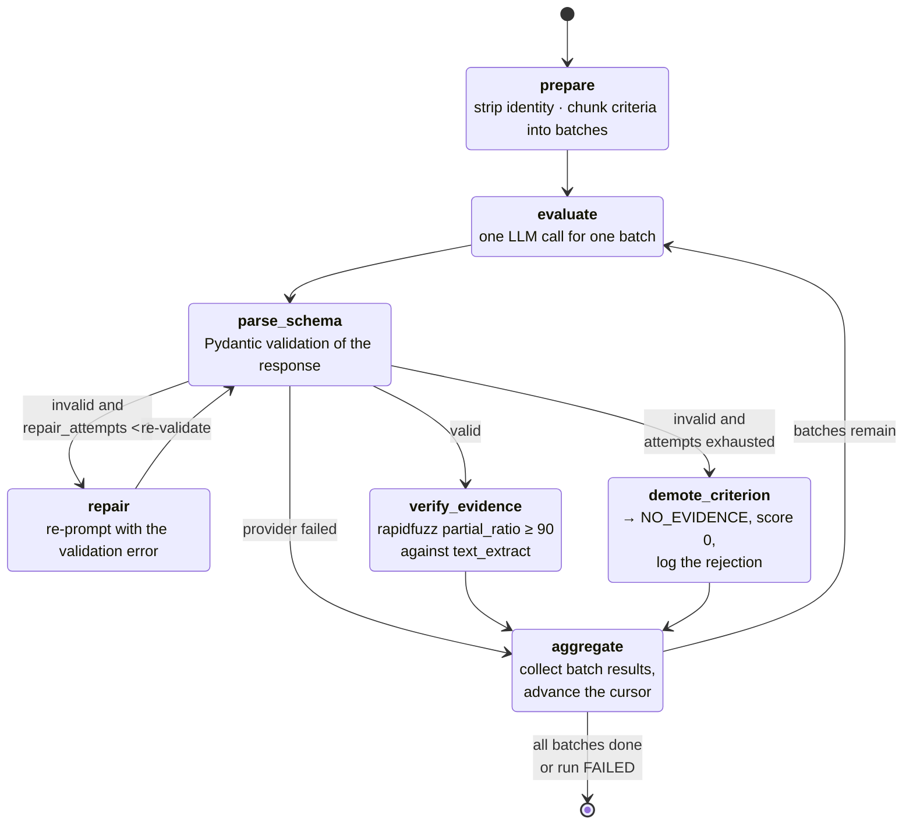

# Evaluation State-Transition Diagram

The LangGraph state machine in
[`core/ai/graphs/evaluation.py`](../../core/ai/graphs/evaluation.py).

This diagram stands in for the usual sequence diagram, and it is a better
artifact for this system: the evaluation flow has two conditional failure
loops, which a sequence diagram draws badly and a state machine draws exactly.
It is also the answer to *"why a graph at all, rather than a function that
calls the API?"* — the retry policy is a property of the diagram rather than
something buried in nested `try/except`.

Graph version: `eval-graph-v1`. Default batch size: 4 criteria per model call.



## Graph state

```python
class EvalState(TypedDict):
    rubric: RubricDTO
    text: str
    batches: list[list[CriterionDTO]]
    cursor: int
    raw_responses: list[dict]
    parsed: list[CriterionResult]
    rejections: list[EvidenceRejection]
    repair_attempts: int
    status: Literal["RUNNING", "COMPLETE", "FAILED"]
```

## The rules the shape encodes

| Rule | Where it shows |
|---|---|
| **One repair attempt per batch, never two.** | `repair` loops back into `parse_schema`, so a second failure arrives with `repair_attempts` already at the cap and is routed to `demote_criterion` instead |
| **A bad batch never fails the run.** | The exhausted-attempts edge goes to `demote_criterion`, not to `[*]`. Its criteria resolve to `NO_EVIDENCE` and the cursor advances |
| **A dead provider *does* fail the run.** | `parse_schema` routes straight to `aggregate` with `status = FAILED`, and `aggregate` exits rather than looping. A provider outage must not be recorded as a page of zeroes |
| **`repair_attempts` resets per batch.** | `aggregate` clears it, so one repaired batch does not consume the next batch's allowance |
| **`last_error` survives only a failure.** | `aggregate` keeps it when the status is `FAILED` and clears it otherwise, so the grid has something to show the faculty member |
| **The guard is a node, not a post-processing step.** | `verify_evidence` and `demote_criterion` are inside the graph, so rejections are checkpointed and inspectable rather than being a filter someone could skip |
| **No arithmetic happens here.** | `aggregate` assembles verdicts and per-criterion raw scores. Totals are computed afterwards, by `core/scoring/engine.py`, from the persisted rows |

## Checkpointing

`thread_id = f"eval:{submission_id}:{evaluation_version}"`

Deterministic on purpose, and the distinction it buys is the point:

* **A browser refresh mid-run** re-enters the same `thread_id`. The
  `SqliteSaver` replays completed nodes from state, so the model is not called
  again for work already done.
* **A deliberate retry** increments `evaluation_version`, which produces a
  *different* `thread_id`. A genuine retry starts clean rather than resuming a
  poisoned checkpoint forever.

Collapsing those two into one behaviour is the failure mode; keeping them
apart is what the deterministic key is for.

## Streaming into the UI

`stream_evaluation` is a generator in `core/ai/` that yields node names as
plain strings. The runner in `app/components/ai_runner.py` writes each into an
`st.status` block and persists after **every** submission, not at the end of
the loop — so a refresh at any point loses at most the submission in flight,
and even that resumes.

Streamlit never touches a graph object, a state dict, or a checkpointer.
