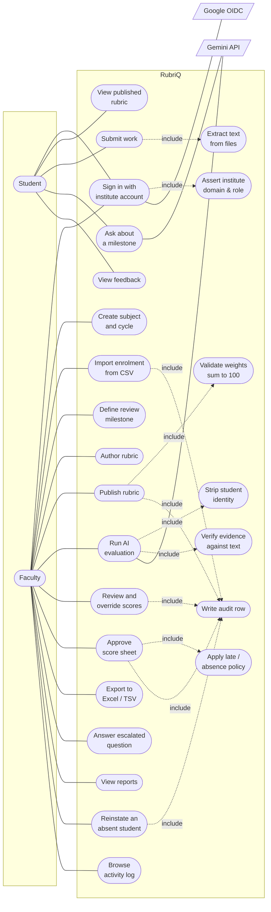

# Use-Case Diagram

Two human actors and two external systems. The dashed `<<include>>` arrows are
the ones worth pointing at in a viva: they are where the invariants sit.

## Principal use cases

| Use case | Actor | Precondition | Postcondition |
|---|---|---|---|
| Publish rubric | Faculty | Draft exists, weights sum to 100, at least one criterion | The version is frozen and becomes selectable for evaluation; an audit row is written |
| Submit work | Student | The milestone is visible and the student is enrolled | A new submission version exists with its text extracted; the student has been told the lateness consequence |
| Run AI evaluation | Faculty | A published rubric and at least one submission exist; a provider key is configured | Each criterion has a verdict and a verified evidence span, or is `NO_EVIDENCE`; the raw response is stored |
| Approve score sheet | Faculty | The evaluation is `COMPLETE` and no mandatory criterion is unresolved | `final_total`, `approved_by`, and `approved_at` are stamped in one transaction; the student's feedback becomes visible |
| Override a score | Faculty | A score sheet exists and a non-empty reason is supplied | An append-only override row is written, the total is recomputed, and the approval is cleared so someone must sign it off again |
| Reinstate an absent student | Faculty | The sheet is `ABSENT` or more than five days late, and a reason is supplied | The penalty is zeroed, a badge carrying the reason is shown, and an audit row is written |
| Ask about a milestone | Student | The milestone has a published rubric | Either an answer sourced from the rubric context, or an escalation with no invented answer |

## Excluded by design

These are not missing; they are refused.

| Not a use case | Why |
|---|---|
| Student selects their own role | Role is resolved server-side from an allow-list (invariant #5) |
| Student views another student's submission or mark | Scoped in SQL, and asserted by a reflection test over `core/**` (invariant #6) |
| AI publishes a mark | Approval is a separate, human, named act (invariant #1) |
| Faculty edits a published rubric in place | Editing clones to v+1; v stays byte-identical (invariant #7) |
| Anyone hard-deletes a submission or evaluation | Everything is append-only and versioned (invariant #7) |
